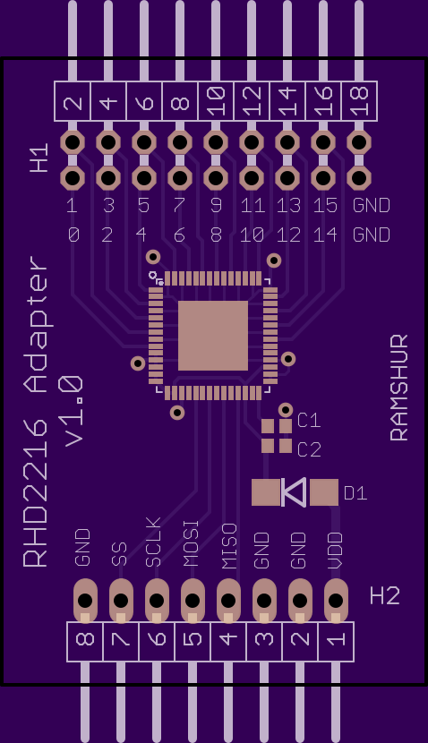
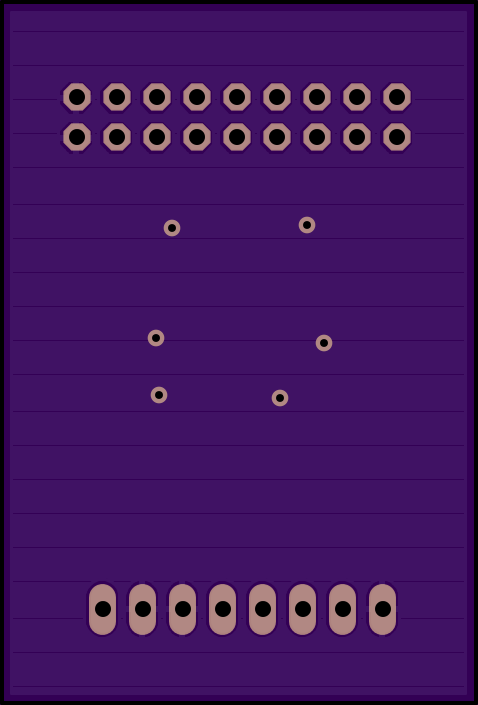

## Description

Adaptor or breakout board for the Intan Technologies RHD2216 electrophysiology interface chip. See Intan's site [here](http://intantech.com/). 

## Contact Info

John T. Ramshur, PhD  
jramshur@gmail.com  
LinkedIn: [http://www.linkedin.com/in/johnramshur](http://www.linkedin.com/in/johnramshur)  
Blog: [http://www.johnramshur.com](http://www.johnramshur.com)

## License

GNU General Public License 3.0
